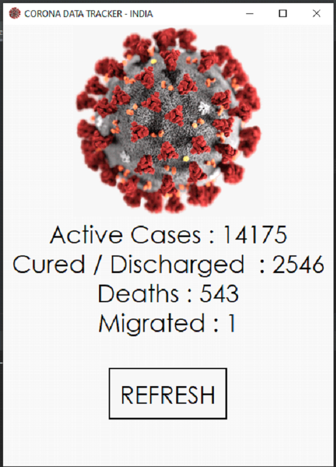
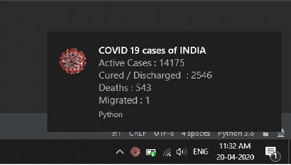

# COVID-19-TRACKER (INDIA) GUI

COVID-19-TRACKER (INDIA) GUI using python
The program tell us the latest data shared by the Indian gov.
of covid-19 from the following website https://www.mohfw.gov.in/"
The system also generates the notification as the default time set is 
(5 min).
## Prerequisites

What things you need to install the software and how to install them

```
python install 
```

### Installing python library for the project
Required python libraries

>open cmd 
And cpy paste the following 
install command

1)requests
install command 
>pip install requests

2)bs4
install command 
>pip install beautifulsoup4

3)plyer
install command 
>pip install plyer

### Download the project
>Download the project by clicking on the  which is on the up-right

#### Run python project in VScode or pycharm
>NOte : before running in the vs code setup the environment of python

> Run successfully






